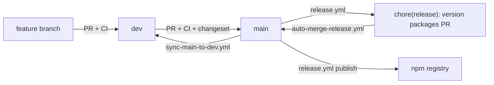

# Branching model

This repo uses a two-branch flow: **`dev`** for integration, **`main`** for
release. The model is intentionally minimal — no long-lived release branches,
no merge train, no GitFlow. The release pipeline is `dev → main → npm` with
Changesets driving the version bumps.

## Branch roles

| Branch | Role                              | Who pushes / merges                        | Auto-publishes? |
| ------ | --------------------------------- | ------------------------------------------ | --------------- |
| `dev`  | Integration / next-release work   | Contributors (via PR from feature branches) or maintainers (direct push for trivial fixes) | No |
| `main` | Released code, mirrors what's on npm | Only via PR from `dev` (or the changesets bot's "Version Packages" PR) | Yes |

Feature branches (`feat/...`, `fix/...`, `chore/...`, etc.) target `dev`. The
only thing that ever targets `main` is a `dev → main` release PR or the
changesets bot.

## Release flow at a glance



1. **Feature branch → `dev`** (PR). CI runs (`ci.yml`). If the change touches
   `packages/*` source, `changeset-status.yml` reminds you to add a changeset.
2. **`dev` → `main`** (PR, periodic). CI re-runs against the merge commit.
   The maintainer merges (squash). This is the only human-driven path that
   reaches `main`.
3. **Push to `main`** triggers `release.yml`. Changesets opens / updates a
   `chore(release): version packages` PR (if there are unconsumed
   changesets) OR publishes directly (if the version PR was just merged).
4. **Version PR** is auto-enabled for merge by `auto-merge-release.yml` once
   CI passes (see "Known gotcha" below).
5. **After publish**, `sync-main-to-dev.yml` fast-forwards `dev` to the new
   `main` tip so version bumps + tags exist on `dev` for the next cycle.
   If `dev` has independent commits, a back-merge PR is opened instead.

## Per-PR contract

Every PR targeting `dev` or `main` runs:

- `ci.yml` → lint + typecheck + build + test on Node 20/22 × Linux/macOS/Windows + `attw` + `publint`
- `changeset-status.yml` → soft-warn if `packages/*/src` changed without a changeset
- `pricing-drift.yml` → only if `packages/core/src/pricing/data.ts` was touched
- `snapshot.yml` → only if PR labelled `release:snapshot` (publishes ephemeral `pr-N` dist-tag preview)

Snapshot releases (`snapshot.yml`) currently target `main` PRs only — i.e.
`dev → main` release PRs. If you need to preview a feature branch on npm,
land it on `dev` first, then label the `dev → main` PR with `release:snapshot`.

## Branch-protection recommendations

These are repository settings, not code — the maintainer must configure them
in **Settings → Branches**.

### `main`

- **Require a pull request before merging** (no direct pushes).
- **Require approvals** (1+).
- **Require status checks to pass before merging**:
  - `Lint & format`
  - `Build & test (ubuntu-latest / Node 20)`
  - `Build & test (ubuntu-latest / Node 22)`
  - `Build & test (macos-latest / Node 20)`
  - `Build & test (macos-latest / Node 22)`
  - `Build & test (windows-latest / Node 20)`
  - `Build & test (windows-latest / Node 22)`
  - `Package quality (attw + publint)`
- **Require branches to be up to date before merging** (so the PR is rebased / merged with current `main` first).
- **Do not allow bypassing the above settings** (so the changesets bot is also gated).
- **Allow auto-merge** (Settings → General → Pull Requests). Required for `auto-merge-release.yml`.

### `dev`

- **Require status checks to pass before merging** (same checks as `main` minus `Package quality` if you want fewer minutes — or keep parity for safety).
- **Require a pull request before merging** is **optional** for `dev`. Trivial fixes (typos, single-file docs) may be pushed directly by maintainers; anything else uses a PR.

## Known gotcha — token cascade (read this if auto-merge stalls)

GitHub does **not** trigger downstream workflows on commits / PRs created
via `GITHUB_TOKEN`. This affects two paths:

1. **Changesets "Version Packages" PR.** Created by `changesets/action` with
   `GITHUB_TOKEN` → CI does not run automatically → branch protection's
   required checks never go green → `auto-merge-release.yml` waits forever.
2. **Sync workflow's back-merge PR.** Same cause — opened with
   `GITHUB_TOKEN`, so CI does not run on `dev` until a human pushes an
   empty commit or closes + reopens the PR.

The fix in both cases is to swap `GITHUB_TOKEN` for either a Personal
Access Token (PAT) with `repo` + `workflow` scopes, or a GitHub App token.
See `RELEASING.md` → "Known gotcha" for the two recipes.

## How to create a `dev → main` release PR

```bash
# From a clean working tree on dev:
git checkout dev
git pull --ff-only
git checkout -b release/$(date -u +%Y-%m-%d)  # optional intermediate branch
git push -u origin HEAD

# Open the PR in the GitHub UI, or:
gh pr create --base main --head dev \
  --title "release: dev -> main ($(date -u +%Y-%m-%d))" \
  --body "Promotes the consumed changesets in \`dev\` to \`main\` for publishing."
```

The PR runs full CI. On merge:
1. `release.yml` runs on `main`.
2. Changesets either publishes (if no unconsumed changesets remain — rare on
   first promotion) or opens a "Version Packages" PR.
3. `auto-merge-release.yml` enables auto-merge on the version PR.
4. Once CI passes on the version PR, it auto-merges.
5. `release.yml` runs again on the merge commit, this time publishing to npm
   with a GitHub Release per package.
6. `sync-main-to-dev.yml` back-merges the version-bump commits + tags into `dev`.

## Hotfix flow

If a critical bug is found in a published version and `dev` is too unstable
to release from:

1. Branch from `main`: `git checkout -b hotfix/<issue> main`.
2. Apply the fix + a `patch` changeset.
3. PR `hotfix/<issue> → main` directly (skip `dev`).
4. After publish, `sync-main-to-dev.yml` brings the hotfix back to `dev`
   automatically (or opens a back-merge PR if `dev` has diverged).

This is the only sanctioned bypass of the `dev → main` flow.
