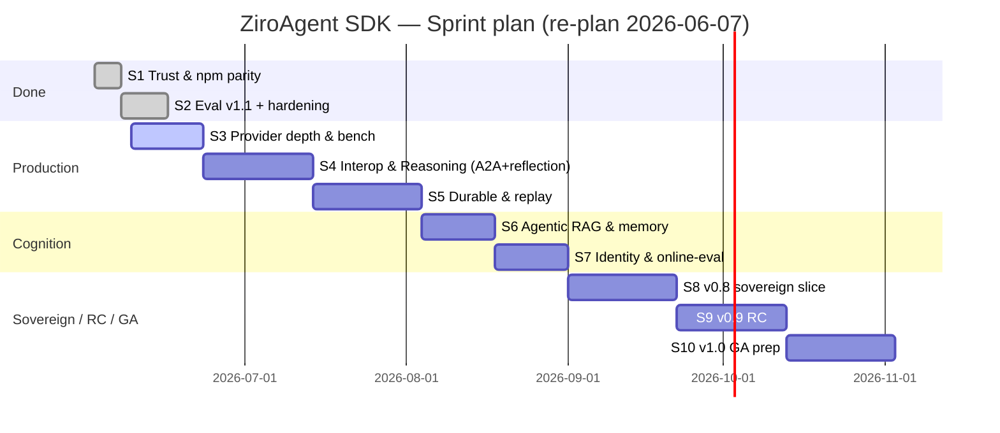

# Kế hoạch Sprint — ZiroAgent SDK

Tài liệu này bám [`ROADMAP.md`](./ROADMAP.md), [`README.md`](./README.md), và [`BENCHMARKS.md`](./BENCHMARKS.md).
**Giả định:** 1 sprint ≈ **2 tuần** (sprint nặng ≈ 3 tuần), một squad, ưu tiên **publish npm + partner-ready** trước greenfield.

**Cập nhật trạng thái:**
- **2026-05-28:** `@ziro-agent/eval@0.5.0` (JSON eval text graders), release CI auth (OIDC fallback) ship.
- **2026-06-07 (re-plan):** **Sprint 2 + một phần Sprint 3/9 đã ship trong một đợt release lớn** (core 0.16 / agent 0.21 / eval 0.6 / audit 0.4 / middleware 0.6 / providers 0.3.x–0.4). README/POSITIONING đã sửa đúng sự thật; thêm doc `audit` + `providers`; RFC 0008 §SOTA-2026 appendix. File này được **plan lại toàn bộ** bên dưới: ✅ đã ship · 🔄 đang dở / nợ kỹ thuật · 📋 to-do (re-sequenced).

---

## ✅ Đã ship (cập nhật 2026-06-07)

### Đợt release 2026-06-07 (PR #143 → npm) — money-safety + provider + RC stabilization
| Hạng mục | Map backlog | npm |
|----------|-------------|-----|
| **Budget money-safety**: write-back nested scope (C2), sibling-abort, warn/throw khi `maxUsd` thiếu pricing (C1), hard-budget output cap (C3), `isBudgetExceededError`/`isAPICallError`/`isTimeoutError` | **R5/F3** (sub-agent budget) ✅ | `core@0.16` `tools@0.7` `agent@0.21` |
| **Provider robustness**: default timeout, network-error→retryable APICallError, honour `Retry-After`, Anthropic mid-stream error frames, redact Google key | (mới — production-readiness) | `openai/anthropic/google/ollama@0.3.x` `middleware@0.6` |
| **Error `code` + `docsUrl`** mọi class (agent/middleware/inngest/streaming/testing extend ZiroError) | **R1/B3** ✅ | `core@0.16` `agent@0.21` |
| **Public surface khoá** (`core/index.ts` named exports, bỏ `export *`) | **A3** (phần surface) ✅ | `core@0.16` |
| **Audit HMAC signing** (tamper-evidence, fail-closed verify) | **C** (audit publish+doc) ✅ | `audit@0.4` |
| **Eval v1.1**: `llmJudge` trong `*.eval.json` (`judgeModel.mock`), `*.eval.yaml` loader, recording-regression | **T5/R10** ✅ | `eval@0.6` `cli@0.5.10` |

### Theo sau (PR #147/#150 — docs/CI, không publish)
| Hạng mục | Trạng thái |
|----------|------------|
| commitlint gate → **lint chỉ PR title** (hết đỏ vì commit lịch sử) | merged main+dev |
| README/POSITIONING **sửa đúng sự thật** (bỏ create-ziro/ziro chat/gateway/Restate/AG-UI overclaim) | merged |
| Docs: trang `audit` + `providers` mới; `budget-guard`/`errors` cập nhật caveat C1/C2 + docsUrl | merged |
| ROADMAP + sprint **SOTA refresh**; RFC 0008 §SOTA-2026 appendix | merged |

### Trước đó
JSON eval v1 text graders (`eval@0.5`), `@ziro-agent/groq`, OpenAPI POST/PUT/PATCH, recording-regression slice, compliance/audit/sandbox-*/browser-* đã publish, CI release auth (PR #137/#139).

---

## 🔄 Đang dở / nợ kỹ thuật (WIP & ops debt)

| ID | Việc | Trạng thái | Ghi chú |
|----|------|-----------|---------|
| OPS1 | **Trusted Publishers + bật lại provenance** | runbook có (RELEASING.md §Enabling provenance), **chưa thực thi** | Cần admin npmjs.com bind workflow + 1 release kiểm chứng → gỡ token fallback + retry 4h |
| OPS2 | **`sync-main-to-dev.yml` fail** trên protected `dev` (FF-push declined) | đang **sync tay** mỗi lần merge main | Sửa workflow: mở PR sync thay vì FF-push (hoặc nới protection cho release bot) |
| T2/T6 | **Replay-from-trace** đầy đủ (RFC 0015) | slice `createReplayLanguageModel` + agent-recording JSONL có; **pipeline `recordRun`→replay + CLI eval chưa** | Sprint "Durable & replay" |
| T4 | Anthropic `cache_control` auto-inject / OpenAI prompt-cache parity | hiện **chỉ đọc usage + passthrough `providerOptions`** (đã ghi đúng trong README) | Sprint "Provider depth" |
| A3 | Zero-dep core **đầy đủ** | surface đã khoá; core **vẫn dep `zod`** | RC stabilization |
| L2 | Benchmark công khai vs đối thủ | `BENCHMARKS.md` mới có mock + Groq | Cần harness vs AI SDK/Mastra |

---

## 📋 To-do — backlog theo nhóm

### A. Marketing & phát hành (v0.1 còn mở)
- **L1** v0.1.0 launch chính thức (HN/Reddit/X, provenance narrative, GitHub Release).
- **L2** Benchmark công khai vs Vercel AI SDK / Mastra (harness reproducible).
- **L3** 1000★ / 3 design partners.

### B. Net-new SOTA 2026 (đồng bộ [ROADMAP §SOTA refresh](./ROADMAP.md#sota-refresh-2026-06--net-new-gap-analysis) + RFC 0008 §SOTA-2026)
| ID | Mục | Tier | Nhà ở |
|----|-----|------|-------|
| **A8** | **A2A** protocol (agent↔agent interop, chuẩn AAIF) | **P0** | `@ziro-agent/a2a` (mới) + RFC |
| **F5** | **Reflection / self-correction** trên tool-error (diagnose→fix hook) | **P0** | `@ziro-agent/agent` |
| **E8** | **Agentic RAG** (`createRetrievalTool` retrieve-as-tool đa bước) | **P1** | `@ziro-agent/memory` |
| **E9** | **Memory cognition** (episodic/procedural scope) | **P1** | extends RFC 0011 |
| **Q1** | **Agent identity & authz** (OAuth OBO, scoped/JIT token) | **P1** | `@ziro-agent/auth`? hoặc doc app-layer |
| **D5** | **Online output-safety / quality scoring** | **P1** | `@ziro-agent/eval` |
| **E7** | KG memory (Graphiti/Zep temporal graph) | **P2** | future |

### C. RC stabilization (v0.9) — còn lại sau khi R1/R5 đã xong
- **R2** `@ziro-agent/codemod` v0→v1.
- **R4** Loop-guard defaults + tests (F2).
- **R6** Goal lock / task persistence (F4).
- **R7** Idempotency-key trên `defineTool` (G1).
- **R8** Auto-checkpoint cadence (G2).
- **R9** Docs 3-layer pass 2, `CONTRIBUTING-ADAPTERS`, `SUPPORT-MATRIX`, release cadence.
- **A3** zero-dep core đầy đủ (xem WIP).

### D. Durable & resilience
- **T1/G5** `@ziro-agent/temporal` — *nay là baseline thị trường, cân nhắc nâng từ defer*.
- **T2/T6** Replay-from-trace pipeline + CLI eval (xem WIP).

### E. Provider depth & multimodal
- **T4** Anthropic `cache_control` / OpenAI prompt-cache parity (xem WIP).
- **M1** `loadDocument` OCR ảnh + registry URI (E5).
- **M2** Memory durable backends + `MemoryProcessor` tracing.
- **E6** Vector adapters (Qdrant / Pinecone / Weaviate).
- **O2** Long-context auto-compaction hook. **K2** Semantic cache.

### F. Sovereign & compliance (v0.8)
- **S1** `@ziro-agent/vllm` + `@ziro-agent/tgi`. **S2** Preset tokenizer VN. **S3** Air-gapped bundle. **S4** Compliance pack templates sâu (RFC 0016).

### G. Chưa có source (planned)
`@ziro-agent/gateway`, `agui`, `react`, `nestjs`, `lmstudio`.

### H. v1.0 GA
API freeze, deprecation table, migration + codemod 100%, benchmark v1, governance BDFL→vote, Ziro Cloud GA.

### I. Anti-roadmap (KHÔNG xây)
gateway daemon, LLM-routing agent, self-editing memory, full Letta-tier memory, no-code builder, tool marketplace, Kanban multi-agent, voice agents. (A8 *adapter* + F5 *hook* là primitive ghép được — không vi phạm.)

---

## Timeline (Gantt) — re-sequenced từ 2026-06-07

---

## Sprint 1 — Trust, docs, npm parity ✅ (đóng)
README packages-table, publish compliance/audit/sandbox/browser, cookbooks, CONTRIBUTING.

## Sprint 2 — Eval v1.1 + production hardening ✅ (đóng 2026-06-07)
`llmJudge`+YAML eval, **budget money-safety C1/C2/C3**, **provider robustness**, **error code+docsUrl**, **audit HMAC**, public-surface khoá, commitlint title-only, README accuracy. *(Mở rộng ngoài kế hoạch gốc — gộp một phần Sprint 3/9.)*

## Sprint 3 — Provider depth & benchmarks (2 tuần) — ĐANG TỚI
| Deliverable | Map | Trạng thái |
|-------------|-----|------------|
| Anthropic `cache_control` auto-inject + OpenAI prompt-cache parity | T4 | 📋 (robustness đã xong) |
| Harness benchmark vs AI SDK/Mastra (methodology doc) | L2 | 📋 |
| `pnpm bench` CI artifact ổn định | L2 | 📋 |
| **OPS1** Trusted Publishers + provenance; **OPS2** sửa sync-main-to-dev | ops debt | 🔄 |

**Exit:** `BENCHMARKS.md` có ≥1 bảng so sánh reproducible; release pipeline hết firefighting.

## Sprint 4 — Interop & Reasoning (3 tuần) — **MỚI (net-new SOTA P0)**
| Deliverable | Map |
|-------------|-----|
| RFC `@ziro-agent/a2a` + server/client tối thiểu (AAIF A2A) | A8 |
| Reflection/self-correction hook trong agent loop (diagnose tool-error → fixed call) | F5 |
| Example: agent Ziro hợp tác qua A2A + cookbook reflection | A8/F5 |

**Exit:** một agent Ziro phát/nhận task A2A; vòng reflection giảm lỗi tool multi-turn (đo bằng eval).

## Sprint 5 — Durable & replay (3 tuần)
| Deliverable | Map |
|-------------|-----|
| `recordRun` JSONL → `createReplayLanguageModel` pipeline đầy đủ + CLI eval replay | T2/T6 |
| Quyết định **Temporal** ship vs defer (nay là baseline) → ghi ROADMAP | T1/G5 |

**Exit:** replay E2E test; quyết định Temporal có văn bản.

## Sprint 6 — Agentic RAG & memory cognition (2 tuần)
| Deliverable | Map |
|-------------|-----|
| `createRetrievalTool()` multi-hop (agentic RAG) trên `@ziro-agent/memory` | E8 |
| Episodic/procedural scope (extends RFC 0011) | E9 |
| Vector adapter Qdrant/Pinecone (≥1) | E6 |

## Sprint 7 — Identity & online eval (2 tuần)
| Deliverable | Map |
|-------------|-----|
| Agent identity/authz: scoped/JIT token helper hoặc doc app-layer (OAuth OBO) | Q1 |
| Online output-safety / quality scoring | D5 |
| `loadDocument` OCR + URI registry | M1 |

## Sprint 8 — Sovereign & compliance v0.8 (3 tuần)
`@ziro-agent/vllm` (MVP), tokenizer VN, air-gapped bundle, compliance pack templates (S1–S4).

## Sprint 9 — v0.9 RC stabilization (2–3 tuần)
codemod (R2), loop-guard (R4), goal lock (R6), idempotency-key (R7), auto-checkpoint (R8), zero-dep core đầy đủ (A3), `SUPPORT-MATRIX`/`CONTRIBUTING-ADAPTERS` (R9).

## Sprint 10 — v1.0 GA prep (3 tuần)
API freeze, migration + codemod coverage, benchmark v1, launch (L1), Ziro Cloud private beta spec.

---

## Ma trận ưu tiên P0 (3 sprint tới)
| P0 | Sprint | Lý do |
|----|--------|-------|
| Provider cache parity + benchmarks + ops debt | S3 | Marketing + production + hết firefighting release |
| **A2A (A8) + Reflection (F5)** | S4 | Gap SOTA lớn nhất — interop 3-lớp + reliability |
| Replay-from-trace + quyết định Temporal | S5 | Resilience + eval |

**Defer rõ:** gateway, agui, react, nestjs → sau v1.0 / partner-pull.

---

## Định nghĩa "done" (mọi sprint)
- Code + test (Vitest) pass CI (lint + matrix + publint/attw + docs build).
- Docs: `apps/docs` page hoặc cookbook.
- Example trong `examples/` nếu là user-facing API.
- Changeset + merge `dev` → PR `main` → Release workflow (npm). **Lưu ý:** sync `main`→`dev` đang phải làm tay (OPS2).
- Cập nhật checkbox `ROADMAP.md` khi milestone đóng.

## Theo dõi
- **GitHub Project:** một cột / sprint, label `sprint-N`.
- **RFC:** [0003](./rfcs/0003-evals-as-first-class.md), [0008 §SOTA-2026](./rfcs/0008-roadmap-v3.md), [0015](./rfcs/0015-resilience.md), [0016](./rfcs/0016-compliance-pack.md); RFC mới cần viết: **A2A (A8)**, **reflection (F5)**.
- **Release:** [`RELEASING.md`](./RELEASING.md), Trusted Publisher `release.yml` (OPS1 chưa xong).
