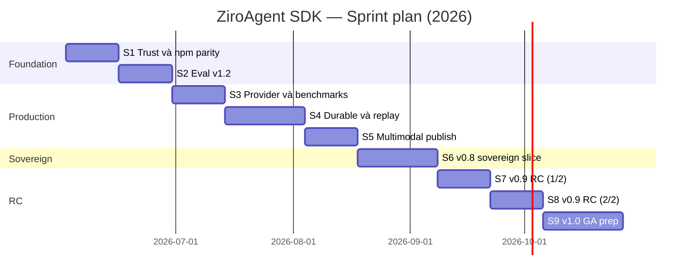

# Kế hoạch Sprint — ZiroAgent SDK

Tài liệu này bám [`ROADMAP.md`](./ROADMAP.md), [`README.md`](./README.md), và [`BENCHMARKS.md`](./BENCHMARKS.md).  
**Giả định:** 1 sprint ≈ **2 tuần** (Sprint 4, 6, 9 ≈ 3 tuần), một squad, ưu tiên **publish npm + partner-ready** trước greenfield.

**Cập nhật trạng thái (2026-05-28):** `@ziro-agent/eval@0.5.0` (JSON eval `exactMatch` / `contains` / `regex`), release CI auth (OIDC fallback + `workflow_dispatch`) đã ship.

**Cập nhật SOTA (2026-06-07):** rà soát SOTA agentic 2026 → bổ sung **mục J** (gap net-new). Tóm tắt: Ziro mạnh trục *production infra* (budget/durable/HITL/MCP/OTel/sovereign) nhưng hụt trục *agent intelligence/coordination*. Đồng bộ với [`ROADMAP.md` §SOTA refresh (2026-06)](./ROADMAP.md). Thay đổi lớn: **A2A đã chuẩn hoá (AAIF/Linux Foundation)** → chuyển từ anti-roadmap sang **P0**.

---

## Đã ship gần đây (không đưa vào backlog sprint)

| Hạng mục | Trạng thái |
|----------|------------|
| JSON eval v1 (`exactMatch`, `contains`, `regex`) | npm `@ziro-agent/eval@0.5.0` |
| `@ziro-agent/groq`, OpenAPI POST/PUT/PATCH, recording regression | `main` + npm |
| CI Release: `setup-npm-publish-auth`, `workflow_dispatch`, rotate script | PR #137, #139 |

---

## Feature / hạng mục chưa release (theo roadmap)

### A. Marketing & chất lượng phát hành (v0.1 còn mở)

| ID | Mục | Ghi chú |
|----|-----|---------|
| L1 | **v0.1.0 launch** chính thức | HN / Reddit / X, provenance narrative, GitHub Release đầy đủ |
| L2 | **Benchmark công khai vs đối thủ** | Vercel AI SDK / Mastra — `BENCHMARKS.md` mới có mock + Groq **TBD** |
| L3 | **1000★ / 3 design partners** | Tiêu chí v0.1, chưa đóng |

### B. v0.2 follow-up (P0 đóng, còn việc)

| ID | Mục | Trạng thái code |
|----|-----|-----------------|
| T1 | `@ziro-agent/temporal` (G5) | Chưa có package — defer v0.6 |
| T2 | **Replay-from-trace** đầy đủ (RFC 0015) | Slice `createReplayLanguageModel` có; JSONL pipeline **chưa** |
| T3 | `samplingEval({ rate })` — trace → eval store | Chưa (P1 / post-v1.0) |
| T4 | Anthropic `cache_control` / OpenAI prompt-cache parity | v0.9 stabilisation |
| T5 | **Eval JSON:** `llmJudge` trong `*.eval.json`, **YAML** datasets | TS + graders có `llmJudge`; JSON schema / YAML chưa |
| T6 | Replay-from-trace trong CLI eval | Gắn RFC 0015 |

### C. Có trong monorepo, chưa npm / README “shipped”

| Package | Roadmap | Việc còn lại |
|---------|---------|--------------|
| `@ziro-agent/compliance` | v0.5 slice | Publish + docs + changeset |
| `@ziro-agent/audit` | v0.5 / v0.8 | README vẫn `planned` — publish & doc |
| `@ziro-agent/sandbox-e2b` / `-daytona` / `-modal` | v0.7 slice | Publish + example E2E |
| `@ziro-agent/browser-playwright` / `-browserbase` | v0.7 slice | Publish + cookbook |
| `@ziro-agent/gateway` | planned v0.2 | **Chưa có source** |
| `@ziro-agent/agui` / `react` / `nestjs` | planned v0.3+ | **Chưa có source** |
| `@ziro-agent/vllm` / `tgi` / `lmstudio` | v0.8 | **Chưa có source** |

### D. v0.4–v0.5 follow-up (P0 code xong, polish)

| ID | Mục |
|----|-----|
| M1 | `loadDocument`: OCR ảnh, registry URI đầy đủ (E5) |
| M2 | Memory: durable backends + `MemoryProcessor` tracing (E1 follow-up) |
| M3 | Governance npm: C1 / C2 / C4 in-repo — release train + eval safety story |

### E. v0.8 Sovereign & compliance

| ID | Mục |
|----|-----|
| S1 | `@ziro-agent/vllm` + `@ziro-agent/tgi` |
| S2 | Preset tokenizer VN (PhoGPT, VinAI, …) |
| S3 | Air-gapped install bundle (tarball, zero network) |
| S4 | Compliance pack sâu (RFC 0016 templates) |

### F. v0.9 RC stabilisation

| ID | Mục |
|----|-----|
| R1 | Error `code` + `docsUrl` mọi class (B3) |
| R2 | `@ziro-agent/codemod` v0→v1 (B5) |
| R3 | Zero-dep core audit (A3) |
| R4 | Loop-guard defaults + tests (F2) |
| R5 | Sub-agent budget propagation (F3) |
| R6 | Goal lock / task persistence (F4, Hermes `/goal`) |
| R7 | Idempotency-key trên `defineTool` (G1) |
| R8 | Auto-checkpoint cadence (G2) |
| R9 | Docs 3-layer pass 2, `CONTRIBUTING-ADAPTERS`, `SUPPORT-MATRIX`, release cadence |
| R10 | JSON/YAML eval hoàn chỉnh (JSON v1 text graders có; thiếu YAML + `llmJudge` trong JSON) |

### G. v1.0 GA

API freeze, bảng deprecation, migration + codemod 100%, benchmark v1, governance BDFL→vote, **Ziro Cloud GA** (free tier + pricing; không lock-in OSS).

### H. Post-v1.0 P1 (rolling, ~6 tháng sau GA)

`samplingEval`, `@ziro-agent/eval/safety`, trace→Playground, eval-on-trace drift, vector adapters (Qdrant / Pinecone / …), semantic cache, AG-UI + `@ziro-agent/react`, NestJS, edge recipes, `agentskills.io` loader, transcript search FTS, cron cookbook, …

### I. P2 / Anti-roadmap (không sprint sớm)

~~A2A~~ (→ **mục J**, đã chuẩn hoá → P0), tool marketplace, speculative execution, Kanban multi-agent, voice agents, `ziro-engine`, gateway daemon, …

### J. SOTA refresh 2026-06 — gap net-new (đồng bộ ROADMAP §SOTA refresh)

Khoảng trống mới so với SOTA agentic 2026, **chưa** nằm rõ trong backlog cũ. Đầy đủ căn cứ + tier trong [`ROADMAP.md` §SOTA refresh (2026-06)](./ROADMAP.md#sota-refresh-2026-06--net-new-gap-analysis).

| ID | Gap | Tier | Nhà ở (package) | Cần |
|----|-----|------|-----------------|-----|
| **A8** | **A2A** (agent↔agent interop, chuẩn AAIF) | **P0** | `@ziro-agent/a2a` (mới) | RFC + server/client. Ziro mới có lớp MCP của "stack 3 lớp"; thiếu lớp A2A |
| **F5** | **Reflection / self-correction** trên tool-error (diagnose→fix) | **P0** | `@ziro-agent/agent` | Hook `reflect`/`critic`; `repairToolCall` hiện chỉ sửa *parse* |
| **E8** | **Agentic RAG** (retrieve-as-tool đa bước) | **P1** | `@ziro-agent/memory` | `createRetrievalTool()` lặp; dựa trên E2–E4 đã ship |
| **E9** | **Memory cognition** (episodic/procedural scope) | **P1** | extends RFC 0011 | Bổ sung scope cho memory tiers |
| **Q1** | **Agent identity & authz** (OAuth OBO, scoped/JIT token) | **P1** | `@ziro-agent/auth`? hoặc doc app-layer | Frontier doanh nghiệp 2026 (IETF draft) |
| **D5** | **Online output-safety / quality scoring** | **P1** | `@ziro-agent/eval` | OTel semconv *không* phủ output-eval — cơ hội khác biệt |
| **E7** | KG memory (Graphiti/Zep temporal graph) | P2 | future | Cặp với E9 |

**Đã có ID, chỉ chưa ship (không cần ID mới):** E6 vector adapters (Qdrant/Pinecone), O2 long-context compaction hook, G5 Temporal (nay là baseline thị trường — cân nhắc nâng), K2 semantic cache.

**Anti-roadmap giữ nguyên:** gateway daemon, LLM-routing agent, self-editing memory, full Letta-tier memory, no-code builder. F5 (hook) và A8 (adapter) là primitive ghép được, không phải god-object.

**Đề xuất chèn sprint:** A8 + F5 (P0) nên thành **một sprint "Interop & Reasoning"** ngay sau S3 (provider/benchmarks), trước S4 durable. E8/E9/Q1/D5 rải vào S5–S7.

---

## Timeline (Gantt)

---

## Sprint 1 — Trust, docs, npm parity (2 tuần) ✅

**Mục tiêu:** Đồng bộ marketing ↔ npm; đóng khoảng “có code chưa publish”.

| Deliverable | Map roadmap | Trạng thái |
|-------------|-------------|------------|
| Cập nhật README bảng packages (compliance, audit, sandbox, browser) | v0.1.9 / v0.5 / v0.7 | ✅ 2026-05-28 |
| Publish npm: `compliance`, `audit`, `sandbox-*`, `browser-*` | v0.5, v0.7 | ✅ đã trên npm (verify `npm view`) |
| Cookbook: compliance offline + sandbox + browser smoke | v0.5, v0.7 | ✅ `compliance-offline`, `sandbox-browser-smoke` |
| `CONTRIBUTING.md` + sync `dev` ← `main` | Ops | ✅ CONTRIBUTING; sync `dev` khi merge PR |
| Điền 1 dòng Groq bench vào `BENCHMARKS.md` | v0.2 Track 3 | ✅ template + hướng dẫn (số điền khi có `GROQ_API_KEY`) |

**Exit criteria**

- [x] Mọi package P0 slice trong repo đều `pnpm add` được.
- [x] README không còn `planned` sai cho package đã publish.

---

## Sprint 2 — Eval v1.2 & CI (2 tuần) ✅

**Mục tiêu:** Hoàn thiện declarative eval trước v0.9.

| Deliverable | Map | Trạng thái |
|-------------|-----|------------|
| `llmJudge` trong `*.eval.json` (schema + CLI) | v0.2 Track 5 / v0.9 | ✅ `judgeModel.mock` + CLI |
| YAML dataset loader | v0.9 | ✅ `*.eval.yaml` / `*.eval.yml` |
| Example + docs `evals.mdx` | v0.1.9 | ✅ example + cookbooks |
| Recording JSONL → regression: thêm case CI gate | v0.2 Track 5 | ✅ test + `recording-smoke.mjs` |

**Exit criteria**

- [x] `ziroagent eval` chạy JSON đủ text graders + `llmJudge` (mock).
- [x] CI gate trên PR với dataset mẫu (`example-eval-json-dataset` smoke + unit tests).

---

## Sprint 3 — Provider depth & benchmarks (2 tuần)

**Mục tiêu:** Inference wedge + số liệu công khai.

| Deliverable | Map |
|-------------|-----|
| Anthropic `cache_control` blocks surfaced | v0.2 / v0.9 |
| OpenAI prompt-cache parity | v0.2 / v0.9 |
| Harness benchmark vs AI SDK (methodology doc) | v0.1, v1.0 |
| `pnpm bench` CI artifact / workflow ổn định | v0.1 |

**Exit criteria**

- `BENCHMARKS.md` có ít nhất một bảng so sánh reproducible (không chỉ mock).

---

## Sprint 4 — Resilience & durable (3 tuần)

**Mục tiêu:** Production outage story.

| Deliverable | Map |
|-------------|-----|
| JSONL `recordRun` → `createReplayLanguageModel` pipeline | v0.6 L1, v0.2 T2 |
| CLI/docs: replay eval từ trace | RFC 0015 |
| `@ziro-agent/temporal` **hoặc** RFC spike + defer doc nếu không có partner | v0.6 G5 |
| Circuit-breaker tuning trong publish retry (nếu còn pain) | Ops |

**Exit criteria**

- Replay E2E test.
- Quyết định Temporal ship vs defer ghi vào `ROADMAP.md`.

---

## Sprint 5 — Multimodal & adapters GA (2 tuần)

**Mục tiêu:** v0.7 “demo cycle” — sandbox + browser từ npm.

| Deliverable | Map |
|-------------|-----|
| `loadDocument` OCR + URI registry (E5) | v0.4 |
| Example: code-interpreter + browser trong một agent | v0.7 |
| Docs multimodal (audio/file) provider matrix | v0.7 I2/I3 |

**Exit criteria**

- Partner chạy sandbox + browser từ npm, không cần clone monorepo.

---

## Sprint 6 — Sovereign & compliance v0.8 slice (3 tuần)

**Mục tiêu:** VN/SEA banking wedge.

| Deliverable | Map |
|-------------|-----|
| `@ziro-agent/vllm` (MVP) | v0.8 O4 |
| `@ziro-agent/tgi` (MVP) hoặc spike | v0.8 O4 |
| Compliance pack templates (RFC 0016) | v0.8, v1.0 |
| `agent.deleteUserData` propagation doc + test | v0.8 GDPR |
| Air-gapped bundle script (alpha) | v0.8 |

**Exit criteria**

- Ollama + vLLM path documented.
- Compliance pack downloadable offline.

---

## Sprint 7 — v0.9 RC (phần 1) (2 tuần)

| Deliverable | Map |
|-------------|-----|
| Error `code` + `docsUrl` (B3) — ~80% error classes | v0.9 |
| Loop-guard + sub-agent budget (F2, F3) | v0.9 |
| `SUPPORT-MATRIX.md`, `CONTRIBUTING-ADAPTERS.md` | v0.9 N1, J3 |

**Exit criteria**

- Errors có `code` + link docs trong playground trace.

---

## Sprint 8 — v0.9 RC (phần 2) (2 tuần)

| Deliverable | Map |
|-------------|-----|
| Goal lock API hoặc `prepareStep` pattern certified (F4) | v0.9 |
| Idempotency + auto-checkpoint (G1, G2) | v0.9 |
| `@ziro-agent/codemod` skeleton + 3 transform quan trọng | v0.9 B5 |
| Zero-dep core audit (A3) | v0.9 |

**Exit criteria**

- Codemod chạy được trên example migration.
- Goal lock có test + cookbook.

---

## Sprint 9 — v1.0 GA prep (3 tuần)

| Deliverable | Map |
|-------------|-----|
| API freeze announcement + compatibility table | v1.0 |
| `migration.mdx` + codemod coverage audit | v1.0 |
| Benchmark v1.0 republication | v1.0 |
| Launch post + npm provenance narrative | v0.1 L1 |
| Ziro Cloud private beta spec (không block OSS) | v1.0 |

**Exit criteria**

- Tag **v1.0.0**, semver strict.
- Release train ổn định (`RELEASING.md` + `NPM_TOKEN` / Trusted Publishers).

---

## Sprint 10+ — Post-v1.0 (rolling)

Ưu tiên theo partner pull:

1. `samplingEval` + trace drift (D4)
2. `@ziro-agent/eval/safety` (C5)
3. AG-UI + `@ziro-agent/react`
4. Vector adapters (E6)
5. NestJS + edge recipes
6. `agentskills.io` loader

---

## Ma trận ưu tiên P0 (3 sprint đầu)

| P0 | Sprint | Lý do |
|----|--------|-------|
| Publish compliance / sandbox / browser | S1 | Trust + README accuracy |
| Eval `llmJudge` + YAML | S2 | Roadmap + vừa ship JSON text graders |
| Benchmarks + cache providers | S3 | Production + marketing |
| Replay JSONL | S4 | Eval + resilience |
| vLLM | S6 | Sovereign pillar |

**Defer rõ:** `gateway`, `agui`, `react`, `nestjs`, Kanban, A2A → sau v1.0 hoặc hợp đồng partner.

---

## Định nghĩa “done” (mọi sprint)

- Code + test (Vitest) pass CI.
- Docs: `apps/docs` page hoặc cookbook.
- Example trong `examples/` nếu là user-facing API.
- Changeset + merge `dev` → `main` → Release workflow (npm).
- Cập nhật checkbox trong `ROADMAP.md` khi milestone đóng.

---

## Theo dõi

- **GitHub Project:** một cột / sprint, label `sprint-N`.
- **RFC tham chiếu:** [0003](./rfcs/0003-evals-as-first-class.md), [0015](./rfcs/0015-resilience.md), [0016](./rfcs/0016-compliance-pack.md), [0008](./rfcs/0008-roadmap-v3.md).
- **Release:** [`RELEASING.md`](./RELEASING.md), `./scripts/rotate-npm-token-for-ci.sh`, Trusted Publisher `release.yml` trên npmjs.com.
